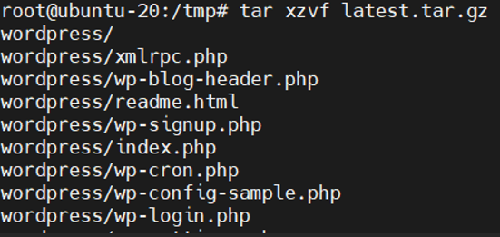
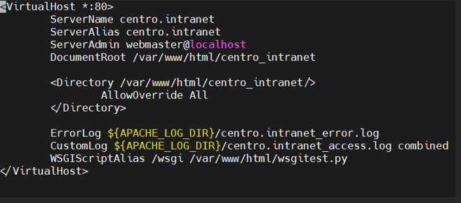
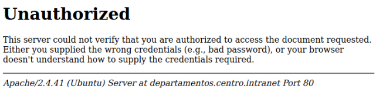
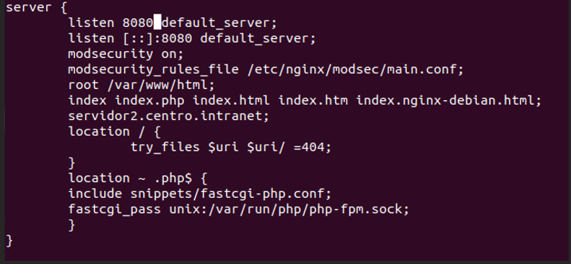
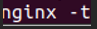
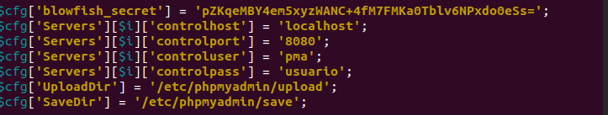
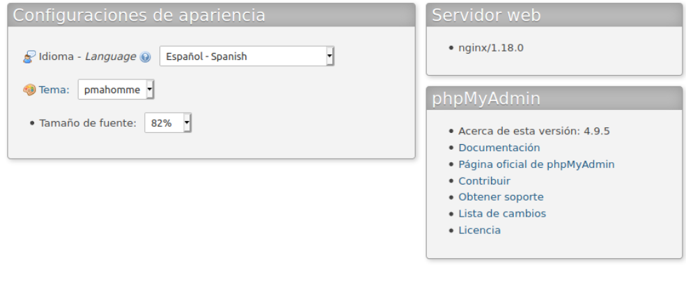

# Proyecto 1.er Trimestre

## Instalación del servidor apache y creacion de los dominios.
Actualizamos el software con un sudo apt update y seguido de ello, haremos un sudo apt install apache2 y ya tendríamos el servidor apache2 instalado.

Ahora crearemos los dominios.
Con sudo mkdir /var/www/html/centro_intranet y sudo mkdir /var/www/html/departamentos_centro_intranet

Introducimos el siguiente comando

Y una vez dentro tendrá que quedarnos algo tal que así

Reiniciamos el apache2 para aplicar los cambios

Y por último haremos lo siguiente

## Instalación de WordPress
Iniciamos sesión root en mysql

Una vez que reciba la instrucción de MySQL, puede actualizar la contraseña del user root

Creamos la base de datos para WordPress con el siguiente comando

Ahora reiniciamos el servidor y descargamos las extensiones necesarias para WordPress

Extraemos el archivo comprimido para así crear la estructura de directorios de WordPress

Moveremos estos archivos a nuestro root de documentos por ahora. Antes de hacerlo, podemos añadir un archivo ficticio .htaccess de modo que esté disponible para que 
WordPress lo use más adelante. Creamos el archivo con touch, Copiaremos sobre el archivo de configuración de muestra al nombre de archivo que lee WordPress. También podemos crear el directorio de actualización

Seguido de lo anterior, realizaremos los ajustes de propiedad y permisos

A continuación, abriremos el archivo de configuración de WordPress

Y ahora introduciremos lo siguiente

Y finalmente escribiendo en el navegador http://centro.intranet debería salir la siguiente imagen

## Módulo WSGI
Iniciamos con el siguiente comando

Damos los permisos

Y en el navegador ponemos la ruta http://centro.intranet.wsgi

## Aplicación Python

## Proteger aplicación Python con creedenciales
nstalamos el paquete de apache2-utils

apt-get install apache2 apache2-utils

Creamos un nuevo usuario y almacenamos la contraseña en el fichero .htpasswd, la contraseña sera usuario

htpasswd -c /etc/apache2/.htpasswd usuario

Entramos en el fichero de configuracion 000-default.conf

nano /etc/apache2/sites-enabled/000-default.conf

Le añadimos las siguentes lineas

Y tendriamos lo siguiente

Guardamos los cambios realizados y reiniciamos apache2

service apache2 restart

Entramos en nuestra pagina donde nos pedira que insertemos la contraseña

Si la ponemos mal nos prohibira entrar con el siguente mensaje

## Instala y configura AWStats
Instalamos AWStats

Habilitamos módulo CGI en Apache

Configuramos AWStats

Después de estos cambios, se necesita construir sus estadísticas iniciales que se generarán a partir de los registros actuales en su servidor. Puede hacerlo utilizando

Configuramos Apache para AWStats
 

 
Ahora para acceder AWSTATS ponemos http://centro.intranet/cgi-bin/awstats.pl?config=centro.intranet.
 

## Instala un segundo servidor (nginx)
Instalamos mysql

Creamos la base de daros y al usuario le damos todos los permisos

Descargamos el paquete phpmyadmin

Instalamosel servidor web Nginx y todos los paquetes necesarios

Editamos el archivo de conmfiguración denominador: PHP.Ini

Habilitamos y configuramos los siguientes elementos del archivo de configuración PHP

Editamos el archivo de configuración de Nginx para el sitio we predeterminado

habilitamos el soporte PHP pata Nginx

Introducimos el siguiente comando

Reiniciamos

Ahora creamos los directorios necesarios y les damos permisos

Creamos este archivo

Y lo editamos con nano  /var/www/html/phpmyadmin/config.inc.php

Y ya por último utilizaremos el siguiente comando para generar la clave aleatoria utilizada en el parámetro denominado: openssl rand -base64 32.

