# Práctica Docker

## Practica 2
### Ejecuta la imagen "hello-world"
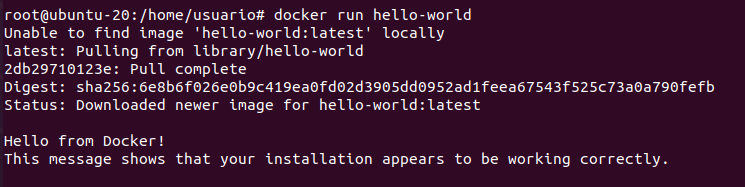
### Muestra las imágenes Docker instaladas
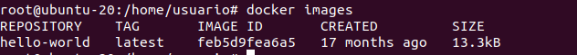
### Muestra los contenedores Docker
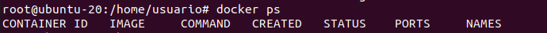
### Edita el fichero Dockerfile
Si usamos una imagen de ubuntu y hacemos docker run -it ubuntu:20.04 obtendremos lo siguiente:
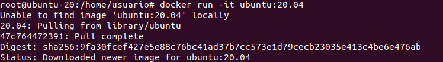
Si consultamos para ver la versión de git nos sale:
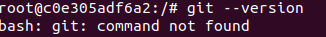
Asi que procedemos a la instalacion de este paquete
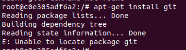
Ahora dentro del dockerfille añadiremos lo siguiente
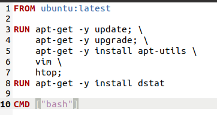

### Construye el contenedor
Primero haremos lo siguiente
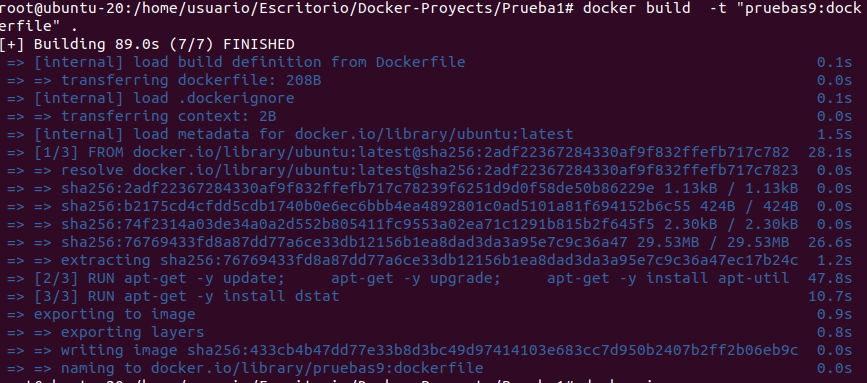
Y ahora ejecutamos el container
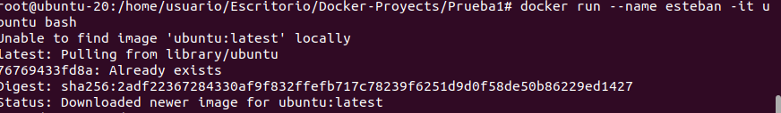
Y aqui podemos ver que esta funcionando

### Create una cuenta en hub.docker.com
Para crearnos la cuenta accederemos a la pagina y seguiremos los pasos

### Publicar container
Para publicarlo seguirmos los siguientes pasos
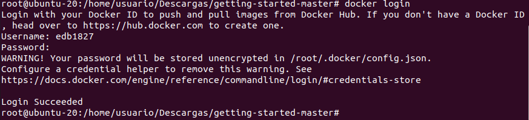
Seguido del login realizamos lo siguiente
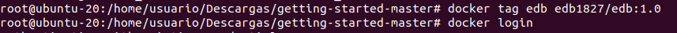
Y ahora hacemos un push para subirlo
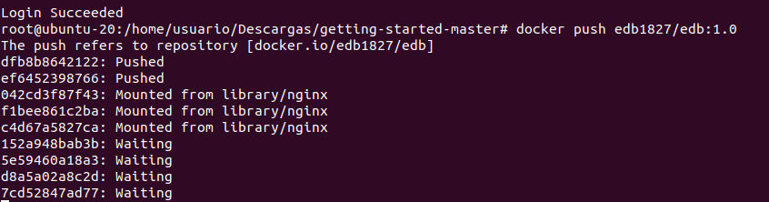
Y ya podemos ver que esta subido
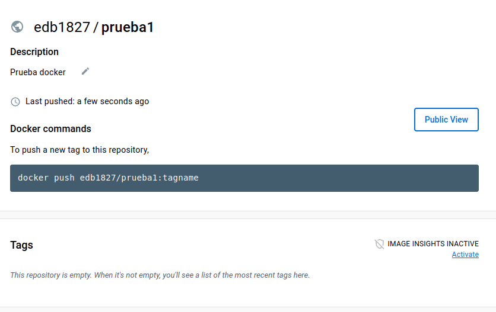
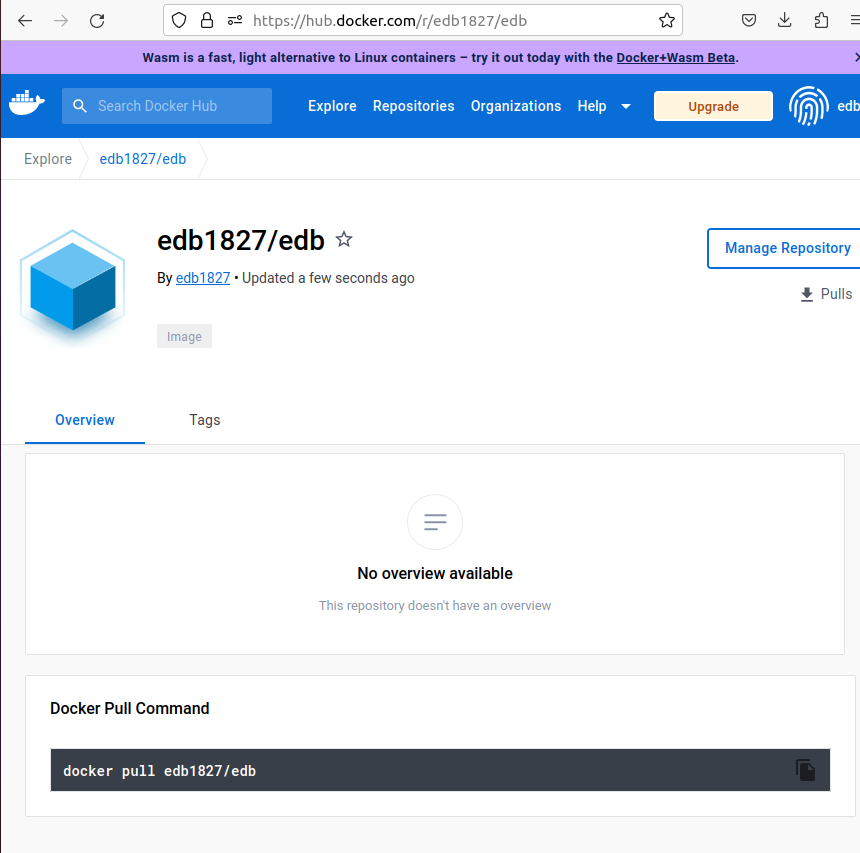

## Práctica 3
### Descarga la imagen de ubuntu
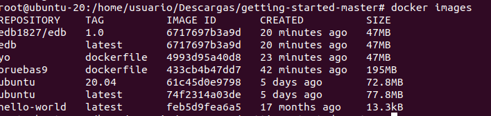
### Descarga la imagen hello-world

### Descarga la imagen nginx
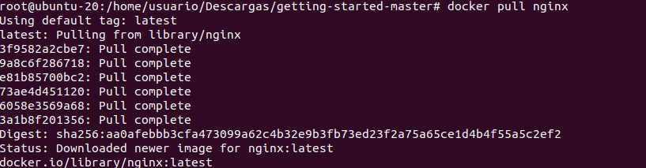
### Listado de todas las imagenes

### Ejecuta un contenedor hello-world y dale nombre “myhello1”, Ejecuta un contenedor hello-world y dale nombre “myhello2”, Ejecuta un contenedor hello-world y dale nombre “myhello3”
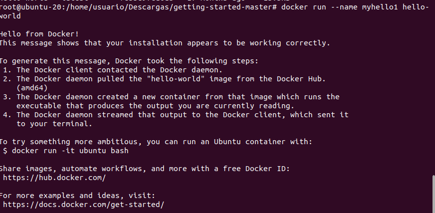
### Muestra los contenedores que se estan ejecutando
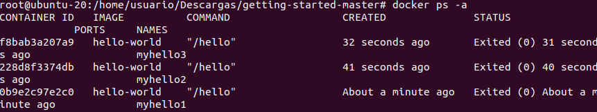
### Para el contenedor myhello1 y myhello2
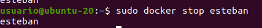
### Borra el contenedor myhello1
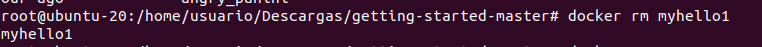
### Muestra los contenedores que se estan ejecutando
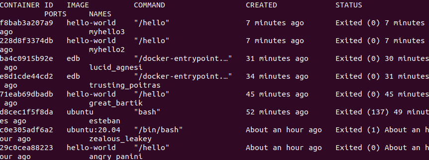
### Borra todos los contenedores
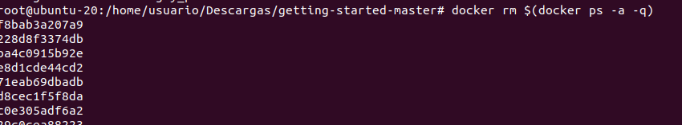
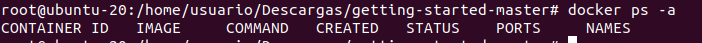

